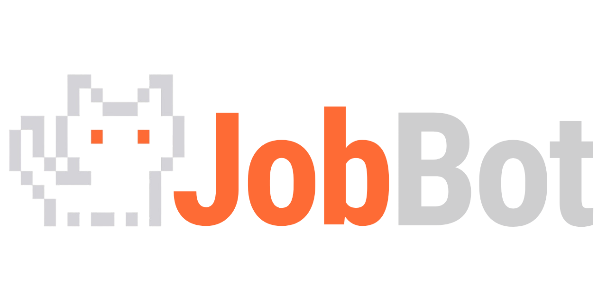
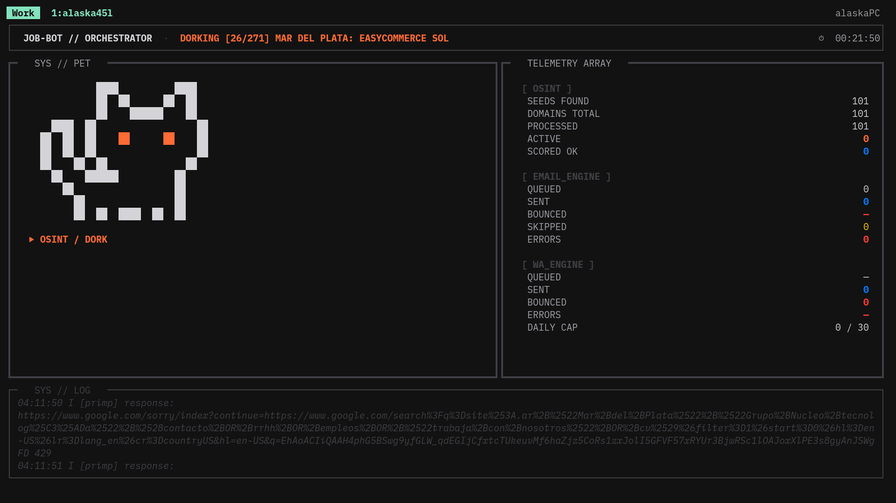
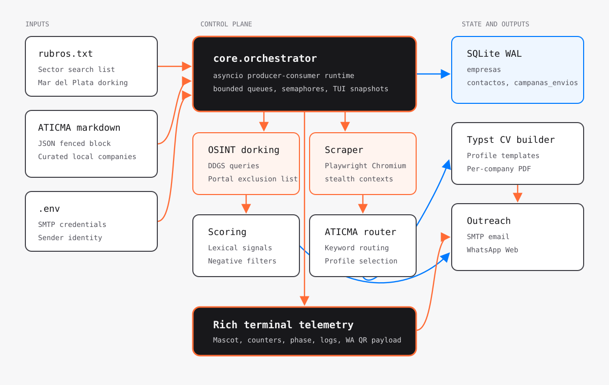

<div align="center">
  
  <h1>JobBot</h1>
  <p><strong>Deterministic OSINT, stealth-oriented scraping, CV routing, and outreach orchestration for targeted job discovery.</strong></p>
</div>

<p align="center">
  
  
  
  
  
</p>

JobBot is a local-first automation pipeline for discovering Argentine company domains, extracting contact signals, scoring whether a company is a useful target, routing the right CV profile, and dispatching carefully paced outreach through SMTP or WhatsApp Web.

It was built from a practical frustration: after months of sending applications through traditional portals with very low response rates, the strategy changed back to something older and more direct: deliver the CV to the company itself. Instead of doing that door-to-door on a rainy afternoon, JobBot turns that workflow into an auditable pipeline.

The project is intentionally not an LLM wrapper. It does not pay an external model to read a basic HTML page or decide whether a contact is useful. The scoring path is lexical, deterministic, testable Python: regular expressions, weighted contact signals, negative filters, and profile routing rules.

## What It Does

JobBot operates as an orchestrator around six runtime responsibilities:

| Responsibility | Implementation | What happens |
| --- | --- | --- |
| Seed discovery | [src/jobbot/core/orchestrator.py](src/jobbot/core/orchestrator.py) | Builds DuckDuckGo search queries from `rubros.txt`, targets `site:.ar`, defaults to Mar del Plata, and filters known job boards, social networks, marketplaces, and public portals. |
| Scraping | [src/jobbot/scraper/engine.py](src/jobbot/scraper/engine.py) | Launches Playwright Chromium with isolated contexts, randomized user agents, Argentine locale/timezone, resource blocking, priority paths, and a `robots.txt` gate. |
| Scoring | [src/jobbot/scoring/engine.py](src/jobbot/scoring/engine.py) | Scores RRHH emails, general emails, WhatsApp numbers, SSL presence, form-only sites, sector keywords, and negative signals such as news/blog/e-commerce patterns. |
| Persistence | [src/jobbot/db/manager.py](src/jobbot/db/manager.py) | Stores companies, contacts, scores, CV profiles, and campaign history in SQLite with WAL mode, `STRICT` tables, foreign keys, and cooldown-aware queries. |
| CV generation | [src/jobbot/cv/builder.py](src/jobbot/cv/builder.py) | Renders a per-company Typst template into a PDF attachment, injecting company name, selected profile, target keywords, and profile-specific content. |
| Outreach | [src/jobbot/outreach/mailer.py](src/jobbot/outreach/mailer.py), [src/jobbot/outreach/wa_sender.py](src/jobbot/outreach/wa_sender.py) | Sends through SMTP with async jitter and cooldowns, or through WhatsApp Web with a persistent browser profile, QR login flow, daily cap, and delivery records. |

## Why It Exists

The repository started as a reaction against two unsatisfying extremes.

The first extreme is the job-board funnel: every application goes through the same platform, the same opaque filters, and the same low-signal intake forms. The second is the modern automation repo that is mostly a wrapper around paid AI APIs, payment forms, and vague promises. JobBot takes the opposite route: build a small deterministic system that can be inspected, run locally, modified, and stopped cleanly.

The design philosophy is strict:

- Determinism over hallucination: classification and routing are implemented with explicit lexical rules and tests.
- Direct company contact over portal dependency: the pipeline looks for first-party domains and direct contact addresses before outreach.
- Back-pressure over runaway concurrency: producer-consumer queues, semaphores, sentinels, and startup handshakes keep scraping bounded.
- Local state over hosted control planes: SQLite is the control database, and credentials are read from the local environment.
- Personalized documents over generic attachments: Typst compiles a CV tailored to the detected company profile before an email is sent.
- A visible machine over silent background work: Rich renders a live terminal control surface for phase, counters, target, logs, and WhatsApp QR state.

## Visual System

The logo and interface are part of the operating model, not decoration. The pixel mascot is used in the terminal UI as a readable state indicator, and the orange/grey palette maps to the project's high-contrast terminal surface.

<p align="center">
  
</p>

The screenshot above shows the live Rich dashboard generated by [src/jobbot/tui/dashboard.py](src/jobbot/tui/dashboard.py). The left panel carries the mascot and active phase, the right panel exposes OSINT, email, and WhatsApp counters, and the bottom log tape shows recent pipeline events. During WhatsApp authentication, the same surface can render QR payload state while the browser session is established.

## Architecture



The central control plane is `core.orchestrator`. In `--dork-scrape` and `--auto` modes, it starts a producer and consumer with an `asyncio.Queue`. The consumer launches Chromium first, signals `consumer_ready`, and only then allows the dorking producer to enqueue domains. That handshake prevents the producer from filling the queue before the browser side is alive.

The scraper writes normalized company and contact data into SQLite. The mailer and WhatsApp sender read from that database using cooldown-aware queries, so outreach is controlled by persisted history instead of in-memory state. The TUI reads snapshots from the orchestrator state object; it does not own the pipeline logic.

## Pipeline Modes

| Mode | Command | Runtime path |
| --- | --- | --- |
| Dork only | `jobbot --dork` | Reads `rubros.txt`, searches, filters domains, and stores seed companies without scraping immediately. |
| Scrape only | `jobbot --scrape` | Reads domains from `jobbot.db`, opens Playwright, scrapes priority pages, scores, and stores contacts. |
| Producer-consumer | `jobbot --dork-scrape` | Runs search and scraping concurrently with queue back-pressure. |
| SMTP campaign | `jobbot --mail` | Selects companies above `--min-score`, compiles a dynamic PDF CV, sends through SMTP, and records campaign state. |
| WhatsApp campaign | `jobbot --wa` | Selects pending WhatsApp contacts, opens WhatsApp Web, authenticates with QR when needed, and sends paced messages. |
| ATICMA pipeline | `jobbot --aticma` | Imports curated ATICMA company JSON from Markdown, scrapes or falls back to curated data, routes CV profile, and sends email. |
| Daemon loop | `jobbot --auto` | Runs dork-scrape plus email in repeated cycles with timeout, failure backoff, and anti-ban pauses. |

The CLI accepts `--concurrencia` from 1 to 10, but the orchestrator caps effective Playwright concurrency with `MAX_PLAYWRIGHT = 2` to protect memory on small machines.

## CV Routing

JobBot currently supports the ATICMA-oriented CV set in [src/jobbot/cv/profiles.py](src/jobbot/cv/profiles.py):

| Profile | Intended fit | Template |
| --- | --- | --- |
| `CV_IT_QA` | QA, support, junior development, infrastructure, security, cloud, IoT, and software teams. | `src/jobbot/cv/templates/cv_it_qa.typ` |
| `CV_BackOffice` | E-commerce, CRM, logistics, business operations, documentation, marketing operations, and process support. | `src/jobbot/cv/templates/cv_backoffice.typ` |
| `CV_Ciencia` | Biotech, green tech, quality control, laboratory work, agro, industrial, and scientific documentation. | `src/jobbot/cv/templates/cv_ciencia.typ` |

The database still accepts legacy labels (`CV_Tech`, `CV_Admin_IT`, `CV_Hybrid`) for compatibility. Outreach templates normalize those labels to the current profiles before choosing subjects and body text.

## Repository Layout

```text
jobbot/
+-- pyproject.toml                 # Package metadata, dependencies, CLI entry point
+-- README.md                      # Project documentation
+-- LICENSE                        # GPL-3.0 license
+-- rubros.txt                     # Sector list used by dorking mode
+-- roadmap.md                     # Local roadmap notes
+-- docs/assets/                   # README logo, screenshot, architecture diagram
+-- cvs/
|   +-- perfil.webp                # Optional profile image copied into Typst builds
|   +-- preview/                   # Preview PDFs for current CV profiles
+-- src/jobbot/
|   +-- cli.py                     # argparse CLI and validation
|   +-- config.py                  # .env-backed runtime configuration
|   +-- core/orchestrator.py       # Async pipeline, TUI state, modes, daemon loop
|   +-- scraper/                   # Playwright scraping, navigation, extraction
|   +-- scoring/                   # Deterministic lexical scoring engine
|   +-- db/                        # SQLite schema, migrations, CRUD queries
|   +-- cv/                        # Typst profile definitions and compiler
|   +-- outreach/                  # SMTP and WhatsApp dispatch engines
|   +-- aticma/                    # Curated ATICMA import, extraction, routing, mail
|   +-- tui/                       # Rich dashboard and mascot presentation
|   +-- utils/                     # Browser stealth script, phone/domain helpers
+-- tests/                         # Focused unit and smoke tests
```

`jobbot.db` is created in the repository root at runtime. It is operational state, not application source.

## Requirements

| Requirement | Used by | Notes |
| --- | --- | --- |
| Python 3.11 or newer | Entire package | Declared in `pyproject.toml`. |
| Playwright Chromium | `--scrape`, `--dork-scrape`, `--wa`, `--auto`, `--aticma` scraping | Install the browser after installing Python dependencies. |
| Typst CLI | `--mail`, `--auto`, `--aticma` mail phase | Must be available on `PATH` as `typst`; PDF generation fails fast if missing. |
| SMTP account | `--mail`, `--auto`, `--aticma` mail phase | App passwords are recommended for providers such as Gmail. |
| WhatsApp Web session | `--wa` | Stored in `src/jobbot/outreach/wa_profile/` at runtime. |
| ATICMA Markdown file | `--aticma` | Defaults to `~/Documents/Curriculums/empresas_ATICMA.md`; pass `--aticma-file` for another path. |

## Configuration

`python-dotenv` is loaded at import time, so a local `.env` file in the repository root is enough for normal operation.

```env
SMTP_HOST=smtp.gmail.com
SMTP_PORT=587
SMTP_USER=your-email@example.com
SMTP_PASS=your-app-password
SENDER_NAME=Your Name
GITHUB_USER=your-github-user
```

| Variable | Required for | Default | Purpose |
| --- | --- | --- | --- |
| `SMTP_HOST` | Email modes | None in `ConfigSMTP.from_env()` | SMTP server hostname. |
| `SMTP_PORT` | Email modes | `587` | SMTP port used with STARTTLS. |
| `SMTP_USER` | Email modes | None | Sender login and email address. |
| `SMTP_PASS` | Email modes | None | SMTP password or provider app password. |
| `SENDER_NAME` | Email and WhatsApp text | `Alaska` | Display name and CV filename component. |
| `GITHUB_USER` | Email signature | `tu-usuario` | Used to render `{github_user}.github.io/` in the signature. |

Runtime limits such as SMTP jitter, WhatsApp jitter, mail cooldown, scraping cooldown, WhatsApp cooldown, and daily WhatsApp cap are currently constants in [src/jobbot/config.py](src/jobbot/config.py).

## Quick Start

From the repository root:

```bash
python -m venv .venv
source .venv/bin/activate
python -m pip install -e '.[dev]'
python -m playwright install chromium
```

Install Typst if you plan to run any mode that compiles CV PDFs:

```bash
cargo install typst-cli
typst --version
```

Check the CLI after the package is installed:

```bash
jobbot --help
```

Run a safe dry run through the email path:

```bash
jobbot --mail --dry-run --min-score 55
```

## Common Workflows

Collect seeds only:

```bash
jobbot --dork --rubros-file rubros.txt --limite-dork 30
```

Scrape domains already stored in SQLite:

```bash
jobbot --scrape --concurrencia 2
```

Run dorking and scraping together:

```bash
jobbot --dork-scrape --concurrencia 2 --limite-dork 30
```

Send an email campaign after reviewing configuration:

```bash
jobbot --mail --min-score 55
```

Preview WhatsApp messages without sending:

```bash
jobbot --wa --dry-run --limite 10
```

Run the ATICMA import, scrape, route, and email path without sending:

```bash
jobbot --aticma --aticma-file ~/Documents/Curriculums/empresas_ATICMA.md --dry-run
```

Run the continuous daemon:

```bash
jobbot --auto --concurrencia 2
```

## Database Model

SQLite is initialized by [src/jobbot/db/manager.py](src/jobbot/db/manager.py). The main tables are:

| Table | Purpose |
| --- | --- |
| `empresas` | Company identity, domain, sector, selected CV profile, score, scrape timestamp, and ATICMA extension fields. |
| `contactos` | Emails and WhatsApp numbers linked to companies with type and priority. |
| `campanas_envios` | Email and WhatsApp send history, CV identifier, subject or phone key, status, and timestamp. |

The database uses WAL mode and foreign keys. Seed rows inserted by dorking receive an old `fecha_scraping` so they are immediately eligible for scraping instead of being blocked by the scraping cooldown.

## Operations And Safety

- The scraper checks `robots.txt` before processing a domain and skips domains denied by that file.
- The scraper reduces bandwidth by blocking images, media, fonts, stylesheets, websockets, manifests, and known non-target domains.
- SMTP sending waits between messages using `SMTP_JITTER_MIN_S` and `SMTP_JITTER_MAX_S`, currently 180 to 480 seconds.
- WhatsApp sending enforces a daily cap from `WA_LIMITE_DIARIO`, currently 30 messages, and waits 180 to 450 seconds between non-first sends.
- Mail cooldown is 90 days by default; scraping and WhatsApp cooldowns are 7 days by default.
- `--dry-run` is meaningful for `--mail`, `--wa`, `--aticma`, and `--auto`; the CLI rejects it for modes where it has no effect.
- The ATICMA pipeline is idempotent at import time because company rows are upserted by domain and email contacts are inserted with uniqueness checks.
- SMTP credentials, WhatsApp browser state, local databases, and generated QR screenshots are trust boundaries. Do not commit real `.env` files or session directories.

## Testing

Install the development extra first:

```bash
python -m pip install -e '.[dev]'
```

Run the test suite:

```bash
python -m pytest -q
```

The current tests cover deterministic scoring, dork query construction, database validation, outreach template behavior, and Typst marker formatting. They do not run live DuckDuckGo, live SMTP, live WhatsApp, or real browser scraping against external companies.

## Troubleshooting

| Symptom | Likely cause | Fix |
| --- | --- | --- |
| `No module named jobbot` | Running from a `src/` layout before installation. | Run `python -m pip install -e .`, then use `jobbot ...` or `python -m jobbot ...`. |
| `No module named dotenv` | Python dependencies are not installed. | Run `python -m pip install -e '.[dev]'`. |
| `Variables de entorno faltantes` | SMTP mode started without required SMTP variables. | Create `.env` with `SMTP_HOST`, `SMTP_USER`, and `SMTP_PASS`. |
| `typst` is not available on `PATH` | PDF compilation requested before installing Typst. | Install `typst-cli` and verify `typst --version`. |
| Chromium launch timeout | Browser binaries or system dependencies are missing. | Run `python -m playwright install chromium`; on Linux, install any missing Playwright system libraries. |
| ATICMA file not found | Default Markdown path does not exist on the machine. | Pass `--aticma-file /path/to/empresas_ATICMA.md`. |
| No companies are ready for mail | Scores are below `--min-score`, there are no email contacts, or companies are in cooldown. | Inspect `jobbot.db`, rerun scraping, or lower `--min-score` for a dry run only. |

## License

JobBot is distributed under the [GNU General Public License v3.0](LICENSE).
